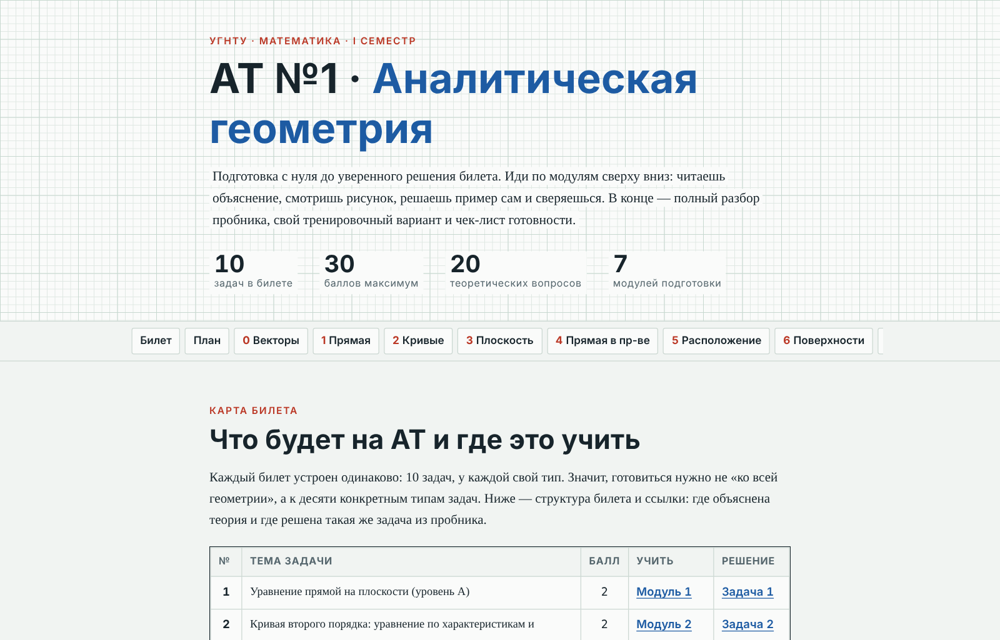
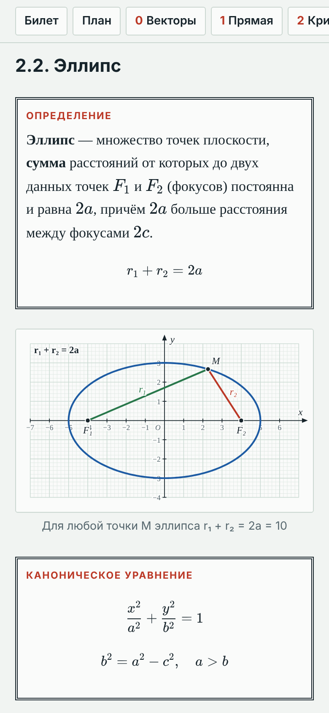
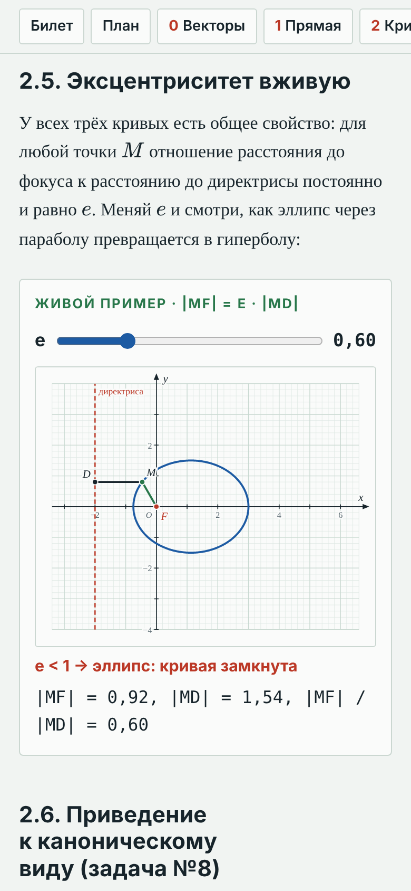
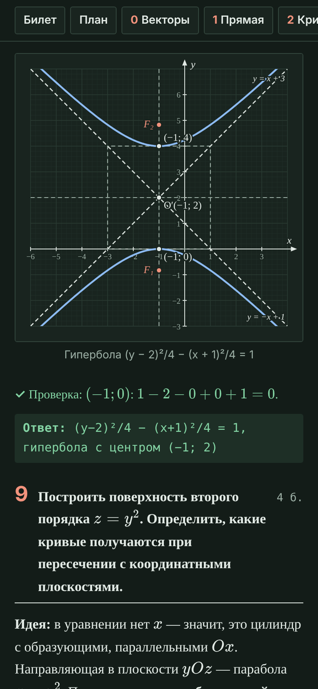
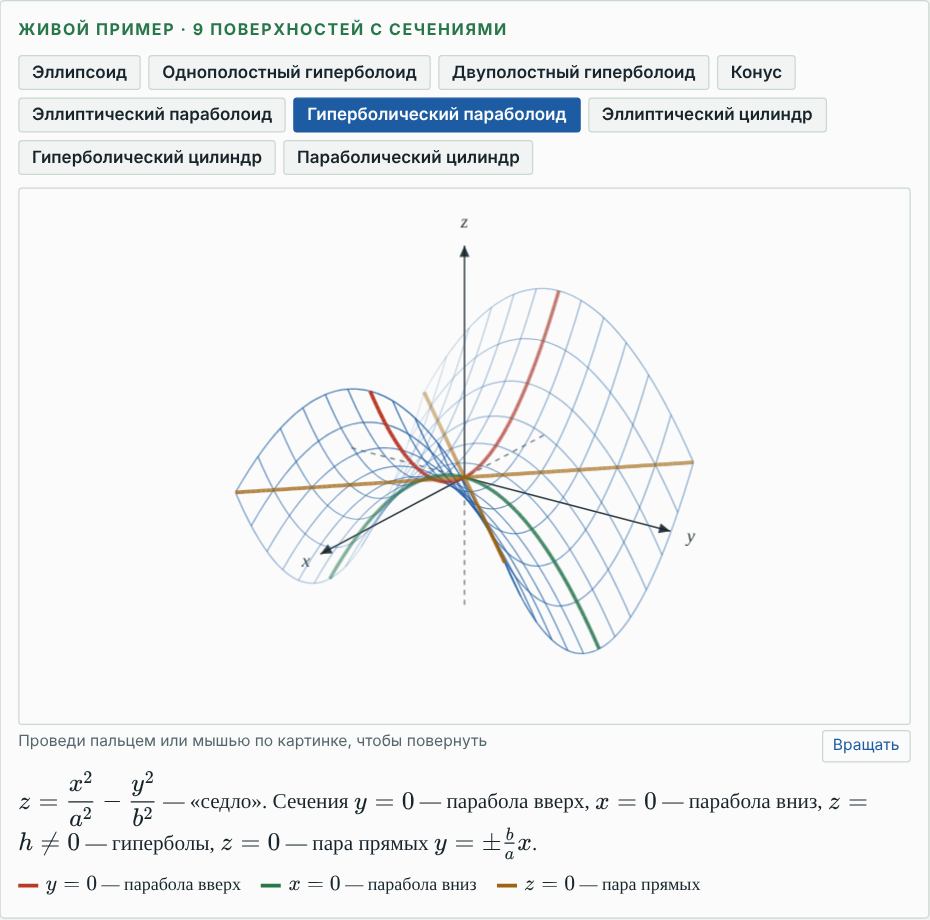
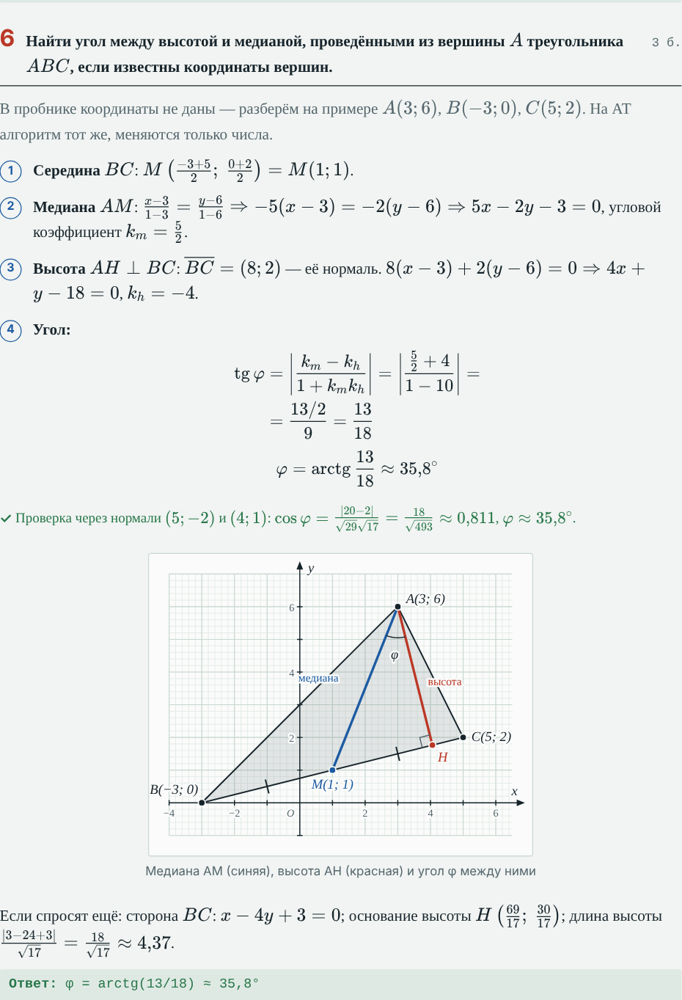

<div align="center">

# АТ №1 · Аналитическая геометрия

**Подготовка к аттестационному тестированию по математике (УГНТУ, I семестр) —<br>с нуля до уверенного решения билета**

### [Открыть сайт →](https://ubicasmerti228.github.io/at1-analytic-geometry/)




</div>

---

## Что это

Одна страница, на которой собрано всё для АТ №1: теория в том порядке, в котором её стоит учить, рисунки к каждой теме, живые интерактивы, полный разбор пробника, свой тренировочный вариант и чек-лист готовности. Открывается с телефона и с компьютера, есть светлая и тёмная тема.

## Что внутри

| Раздел | Что там |
|---|---|
| **Карта билета** | Все 10 задач билета: тема, баллы, где учить теорию и где разобрана такая же задача |
| **План** | Порядок изучения и расписание на 7 дней; короткий маршрут, если осталось 1–2 дня |
| **Модуль 0 · Векторы** | Координаты, длина, скалярное и векторное произведение, определители |
| **Модуль 1 · Прямая на плоскости** | Все виды уравнений, углы, расстояния, задачи на треугольник |
| **Модуль 2 · Кривые второго порядка** | Эллипс, гипербола, парабола, выделение полного квадрата, построение |
| **Модуль 3 · Плоскость** | Через точку и нормаль, через три точки, расстояние от точки |
| **Модуль 4 · Прямая в пространстве** | Канонические и параметрические уравнения, переход от общего уравнения |
| **Модуль 5 · Взаимное расположение** | Углы, параллельность, перпендикулярность, точка пересечения |
| **Модуль 6 · Поверхности** | Метод сечений, 9 поверхностей второго порядка в 3D |
| **Теория** | Все 20 вопросов из списка к АТ №1 с выводами формул |
| **Пробник** | Все 10 задач решены по шагам, с проверкой и рисунками |
| **Тренировка** | Свой вариант в формате билета, ответы под спойлером |
| **Шпаргалка и чек-лист** | Формулы на одном экране, 12 типичных ошибок, 31 пункт готовности |

## Как выглядит

<table>
  <tr>
    <td align="center"><br><sub>Определения с рисунками</sub></td>
    <td align="center"><br><sub>Живой эксцентриситет</sub></td>
    <td align="center"><br><sub>Разбор пробника (тёмная тема)</sub></td>
  </tr>
</table>

<table>
  <tr>
    <td align="center"><br><sub>9 поверхностей — их можно вращать пальцем</sub></td>
    <td align="center"><br><sub>Пошаговое решение с проверкой</sub></td>
  </tr>
</table>

## Карта билета

| № | Тема задачи | Балл | Где учить |
|:-:|---|:-:|---|
| 1 | Уравнение прямой на плоскости (уровень A) | 2 | Модуль 1 |
| 2 | Кривая второго порядка: уравнение ↔ характеристики | 2 | Модуль 2 |
| 3 | Уравнение плоскости, расстояние от точки до плоскости | 2 | Модуль 3 |
| 4 | Уравнение прямой в пространстве | 2 | Модуль 4 |
| 5 | Взаимное расположение прямых и плоскостей | 2 | Модуль 5 |
| 6 | Прямая на плоскости, уровень B | 3 | Модуль 1.5 |
| 7 | Прямая и плоскость в пространстве, уровень B | 3 | Модули 4–5 |
| 8 | Кривая второго порядка: канонический вид и построение | 4 | Модуль 2.6 |
| 9 | Исследование поверхности второго порядка | 4 | Модуль 6 |
| 10 | Теоретический вопрос, развёрнутый ответ | 6 | Теория |
| | **Итого** | **30** | |

## Как пользоваться

1. Открой [сайт](https://ubicasmerti228.github.io/at1-analytic-geometry/) — сверху лента разделов, по ней удобно прыгать.
2. Иди по модулям **0 → 6** сверху вниз: читаешь, смотришь рисунок, решаешь пример сам и сверяешься.
3. Выучи теорию по плану «определение → рисунок → вывод → характеристики → пример».
4. Реши пробник на время и сверься с разбором, потом — тренировочный вариант.
5. Отмечай пункты в чек-листе в конце страницы: отметки сохраняются в браузере.

Сайт — один файл [`docs/index.html`](docs/index.html): формулы и шрифты к ним встроены, поэтому его можно скачать и открывать без интернета.

## Как устроен проект

```
at1-analytic-geometry/
├── docs/
│   ├── index.html        ← готовый сайт (его раздаёт GitHub Pages)
│   └── preview.png       ← картинка для превью ссылки
├── src/
│   ├── content/          ← текст курса: модули, теория, пробник, тренировка
│   ├── figs.js           ← все рисунки (SVG строятся по настоящим уравнениям)
│   ├── plot.js           ← маленькая библиотека 2D/3D-графиков
│   ├── runtime.js        ← интерактивы: прямая, эксцентриситет, 3D, чек-лист
│   ├── style.css         ← оформление «миллиметровка», светлая и тёмная тема
│   └── build.js          ← сборка src/ → docs/index.html
├── tools/
│   └── check_answers.py  ← пересчёт всех ответов
└── assets/               ← скриншоты для этого README
```

## Сборка

```bash
npm install        # ставит KaTeX
npm run build      # собирает docs/index.html
npm run check      # пересчитывает все ответы (нужен Python 3)
```

При сборке каждая формула проходит через KaTeX: если хоть одна написана с ошибкой, сборка останавливается.

## Что проверено

- Все 1226 формул отрисовываются без ошибок.
- Все числовые ответы — в модулях, пробнике и тренировке — пересчитаны скриптом `tools/check_answers.py` (51 проверка, все проходят).
- Вёрстка проверена на ширине экрана от 360 до 1280 px, в светлой и тёмной теме.

## Источник материалов

Структура билета, список теоретических вопросов и пробник 2024–2025 учебного года — материалы кафедры «Информационные технологии и прикладная математика» УГНТУ. Объяснения, решения, рисунки и код — этот репозиторий.
